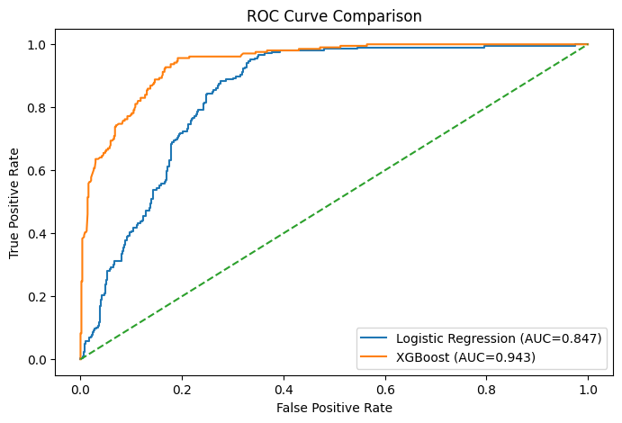
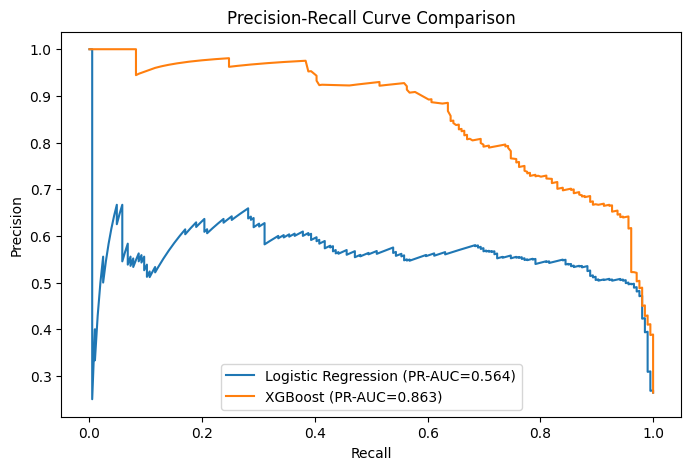
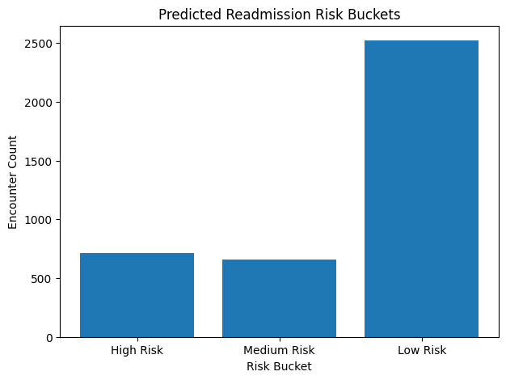
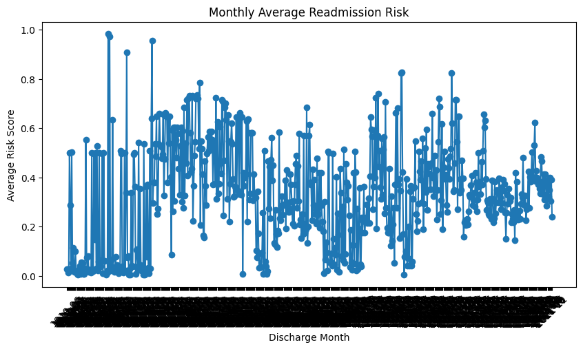
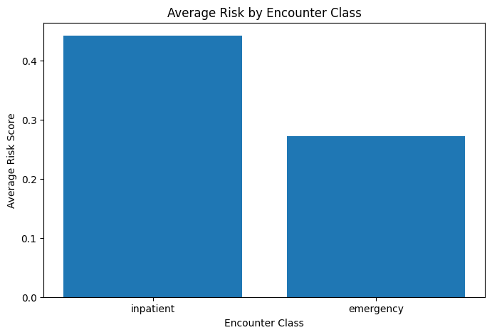

# 🏥 Predicting 30-Day Hospital Readmissions  
### End-to-End Data Engineering + SQL + Machine Learning System

---

## 📌 Project Overview

This project builds a **complete end-to-end healthcare analytics system** to predict whether a patient will be **readmitted within 30 days of discharge**.

Unlike typical ML projects, this solution goes beyond model training by integrating:

- **Relational database design (SQLite)**
- **Advanced SQL feature engineering (CTEs, Window Functions)**
- **Machine Learning (Logistic Regression + XGBoost)**
- **Production-style inference pipeline**
- **SQL-based analytics for decision support**

---

## 🎯 Problem Statement

Hospital readmissions within 30 days are a major concern in healthcare systems as they:

- Increase operational costs 💰  
- Indicate potential gaps in care quality  
- Impact hospital performance metrics  

👉 Goal: Predict high-risk patients **before discharge** to enable preventive interventions.

---

## 🧠 Key Highlights

- Built a **relational healthcare database** using SQLite  
- Engineered features using:
  - JOINs  
  - CTEs  
  - Window Functions (`LEAD`, `ROW_NUMBER`)  
  - Time-based calculations (`JULIANDAY`)  
- Created an **ML-ready feature matrix directly from SQL**
- Implemented:
  - Logistic Regression (baseline)
  - XGBoost (final model)
- Handled **class imbalance** and missing values
- Achieved strong performance:
  - ROC-AUC ≈ 0.94  
  - Recall ≈ 0.88  
  - PR-AUC ≈ 0.86  
- Built an **inference pipeline** writing predictions back to database
- Designed **SQL analytics layer** for risk segmentation and reporting

---

## 📌 Key Results

- **ROC-AUC:** 0.94  
- **Recall:** 0.88  
- **PR-AUC:** 0.86  

---

## 🏗️ System Architecture

Raw CSV Data (Synthea)  
⬇️  
SQLite Database (Schema + Tables)  
⬇️  
SQL Feature Engineering  
⬇️  
ML Feature Matrix  
⬇️  
Machine Learning Models  
⬇️  
Predictions Stored in Database  
⬇️  
SQL Analytics (Risk Reports)

---

## 📊 Model Performance & Insights

### 🔵 ROC Curve
Shows the model’s ability to distinguish between readmitted and non-readmitted patients.

---

### 🟣 Precision-Recall Curve
Important for imbalanced datasets like healthcare.

---

### 🔴 Risk Segmentation
Distribution of patients across risk categories.

---

### 📈 Monthly Risk Trend
Tracks how readmission risk changes over time.

---

### 🏥 Risk by Encounter Type
Highlights which encounter types are more prone to readmission.

---
